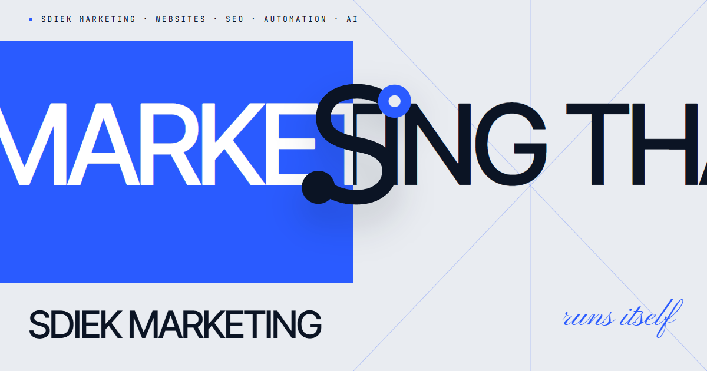

# Sdiek Marketing

Personal brand + studio site for **Sdiek Marketing** by Mohamed Ramadan — bilingual (EN / AR), built with Astro.

**Live:** https://alsakronline-cyber.github.io/sdiek-marketing/ · [English](https://alsakronline-cyber.github.io/sdiek-marketing/en/) · [العربية](https://alsakronline-cyber.github.io/sdiek-marketing/ar/)



- Brand & build rules: [`CLAUDE.md`](CLAUDE.md)
- Open items before launch: [`docs/MISSING.md`](docs/MISSING.md)

```bash
npm install
npm run dev      # http://localhost:4321
npm run build    # static output in dist/
npm run shots    # refresh portfolio screenshots from the live sites (uses local Chrome)
npm run og       # re-render public/og.png
```

Copy `.env.example` to `.env` and fill in the domain, form webhook and booking link.

## Where things live
| What | File |
|---|---|
| Contact details, socials | `src/config/site.ts` |
| Portfolio projects (EN + AR) | `src/data/projects.ts` |
| Services | `src/data/services.ts` |
| Testimonials (only `approved: true` render) | `src/data/testimonials.ts` |
| UI copy (EN / AR) | `src/i18n/en.ts`, `src/i18n/ar.ts` |
| Blog posts | `src/content/blog/{en,ar}/*.md` |
| Motion (cursor, fluid trail, reveals, pins) | `src/scripts/motion.ts` |
| Design tokens | `src/styles/tokens.css` |
